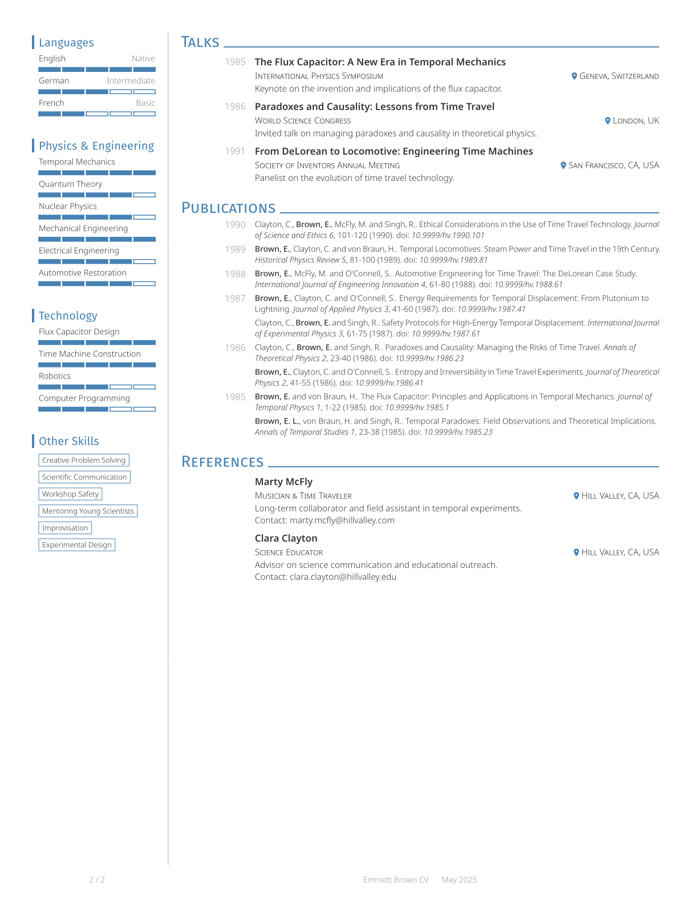

# Neat CV

A modern and elegant CV template for Typst, inspired by [Awesome CV](https://github.com/posquit0/Awesome-CV) and [simple-hipstercv](https://github.com/latex-ninja/simple-hipstercv).

## Features
- Modern, clean two-column layout with sidebar
- Customizable accent color and fonts
- Publication list generated from Hayagriva YAML, grouped by year, with author highlighting
- Level bars for languages and skills
- Social/contact info with icons and clickable links

## Requirements

### Software
- [typst](https://typst.app/) (tested with v0.13.1)

### Fonts
By default, this template uses the Fira Sans and Noto Sans fonts. You will need to install them on your system.
One option is to download them from Google Fonts:
- [Fira Sans](https://fonts.google.com/specimen/Fira+Sans)
- [Noto Sans](https://fonts.google.com/specimen/Noto+Sans)
Most Linux distributions have them available in their package manager.

Additionally, this template uses the FontAwesome icons via the [fontawesome](https://typst.app/universe/package/fontawesome) package.
You can check in their documentation how to install the fonts on your system.

## Example

|                               |                               |
| ----------------------------- | ----------------------------- |
|  |  |